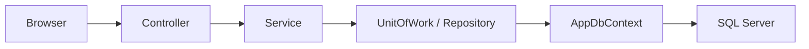

# AlAsma.Admin

مرجع سريع ومركزي للمشروع، هدفه يختصر فهم الكود في أي thread جديد بدون الحاجة لفتح ملفات كثيرة من البداية.

---
## 1. Project Snapshot

**اسم المشروع:** `AlAsma.Admin`  
**النوع:** ASP.NET Core MVC web app  
**الدومين:** إدارة مؤلفين + عقود + مبيعات كتب + أرباح صافية  
**الهدف:** بناء Admin Panel لدار نشر تتيح:

- إدارة المؤلفين وعقودهم
- تسجيل عمليات البيع
- متابعة الإيرادات وصافي الربح
- تخصيص dashboards حسب الدور

**التقنيات الأساسية:**

- `C# / ASP.NET Core MVC`
- `EF Core + SQL Server`
- `Cookie Authentication`
- `Razor Views`
- `Generic Repository + Unit of Work + Service Layer`

---
## 2. Business Goal

المشروع معمول لإدارة دار نشر/توزيع كتب فيها 3 أدوار رئيسية:

- `SuperAdmin`
  - أعلى صلاحية
  - يدير الـ Admins
  - يقدر يدخل على شاشات الإدارة كلها

- `Admin`
  - يدير المؤلفين
  - يسجل ويعدل ويحذف المبيعات
  - يرى dashboards والإحصائيات

- `Author`
  - يدخل بحسابه فقط
  - يرى مبيعاته
  - يرى حالة عقده والأيام المتبقية
  - يرى صافي ربحه

---
## 3. Quick Mental Model

تخيّل المشروع كالتالي:

- `Controller` = يستقبل الطلب من المستخدم
- `Service` = يطبق business logic
- `Repository / UnitOfWork` = يتعامل مع الوصول للبيانات
- `DbContext` = البوابة إلى SQL Server
- `Views` = تعرض الناتج للمستخدم



---
## 4. Current Feature Set

### Authentication

- Login by `Code + Password`
- Cookie auth + role claims
- Redirect حسب الـ role
- Logout
- Access denied page

### Author Management

- List authors
- Create author
- Edit author
- Soft delete author
- Show contract status / days remaining

### Sales Management

- List sales
- Create sale
- Edit sale
- Delete sale
- Show sales by author
- Export reporting-related pages موجودة حالياً

### Dashboards

- `Admin Dashboard`
- `Author Dashboard`
- `SuperAdmin Dashboard`
- `SuperAdmin Admin Management`

---
## 5. Folder Structure

المشروع الفعلي داخل:

`E:\Projects Mvc\AlAsma.Admin\AlAsma.Admin`

أهم الـ folders:

```text
AlAsma.Admin/
├── Areas/
│   ├── Admin/
│   ├── Author/
│   └── SuperAdmin/
├── Controllers/
├── Data/
├── DTOs/
├── Interfaces/
├── Models/
├── Repositories/
├── Services/
├── Views/
└── wwwroot/
```

### Areas

- `Areas/Admin`
  - `AuthorController`
  - `SaleController`
  - `DashboardController`

- `Areas/Author`
  - `DashboardController`

- `Areas/SuperAdmin`
  - `DashboardController`
  - `AdminManagementController`

### Root Controllers

- `AccountController`

---
## 6. Core Files To Read First

لو في thread جديد وعايز تفهم المشروع بسرعة، ابدأ بالترتيب ده:

1. `README.md`
2. `AlAsma.Admin/Program.cs`
3. `AlAsma.Admin/Data/AppDbContext.cs`
4. `AlAsma.Admin/Models/Author.cs`
5. `AlAsma.Admin/Models/Sale.cs`
6. `AlAsma.Admin/Services/AuthorService.cs`
7. `AlAsma.Admin/Services/SaleService.cs`
8. `AlAsma.Admin/Services/DashboardService.cs`
9. `AlAsma.Admin/Areas/Admin/Controllers/SaleController.cs`
10. `AlAsma.Admin/Views/Shared/_Layout.cshtml`

---
## 7. Main Data Model

### `Author`

أهم الحقول:

- `Name`
- `Code`
- `Password`
- `Role`
- `ContractStart`
- `ContractEnd`
- `BasicFees`
- `IsDeleted`

خصائص محسوبة:

- `ContractStatus`
- `DaysRemaining`

### `Sale`

أهم الحقول:

- `BookTitle`
- `AuthorId`
- `SalePrice`
- `BasicExpenses`
- `TotalAmount`
- `Quantity`
- `StoreLocation`
- `SaleDate`

---
## 8. Core Business Rules

هذه أهم القواعد التي يجب اعتبارها “source of truth” أثناء أي تعديل:

- `TotalAmount` يجب أن يُحسب من الـ backend فقط
- المؤلفون يتم حذفهم `Soft Delete`
- المبيعات يتم حذفها `Hard Delete`
- `SuperAdmin` لا يُنشأ من UI، بل من seeding
- `ContractStatus` و`DaysRemaining` قيم مشتقة، ليست بيانات business مستقلة
- المشروع يعتمد على role-based areas بشكل واضح

### Current Financial Logic In Code

حالياً منطق المبيعات قائم على:

```text
TotalAmount = (SalePrice × Quantity) - expenses-related value
```

لكن توجد ملاحظة مهمة:

- معنى `BasicExpenses` يحتاج تثبيت نهائي كمنتج/مواصفة
- هل هي **per transaction** أم **per unit**؟
- لأن بعض الوثائق التاريخية وبعض التنفيذ الحالي يعكسان احتمالين مختلفين

---
## 9. Routing Map

```mermaid
graph TD
    L[Account/Login] --> R{Role}
    R -->|SuperAdmin| SA[/SuperAdmin/Dashboard]
    R -->|Admin| AD[/Admin/Dashboard]
    R -->|Author| AU[/Author/Dashboard]

    SA --> SAM[/SuperAdmin/AdminManagement]
    SA --> AA[/Admin/Author]
    SA --> AS[/Admin/Sale]
    AD --> AA
    AD --> AS
    AU --> MY[/Author/Dashboard]
```

---
## 10. Architectural Notes

المشروع مبني على اتجاه معماري جيد مبدئياً:

- MVC
- Area-based role separation
- Service Layer
- Repository / UnitOfWork
- DTO-based view exchange

لكن توجد ملاحظات حالية يجب تذكرها:

- بعض المسارات ما زالت تتجاوز service boundaries
- بعض queries تسحب بيانات كثيرة ثم تعالجها في الذاكرة
- بعض DTOs تُستخدم لأكثر من use case

يعني: **الأساس جيد، لكن المشروع دخل مرحلة يحتاج فيها tightening للحدود والأداء**

---
## 11. Current Strengths

- structure واضح ومفهوم
- roles والـ Areas معمولين بشكل سهل الفهم
- business domain محدد بوضوح
- dashboards موجودة
- codebase قابل للتحسين بدون rewrite كامل

---
## 12. Current Risks / Known Gaps

هذه ليست “أخطاء نهائية”، لكنها نقاط يجب أخذها في الاعتبار عند أي شغل جديد:

- يوجد drift بين بعض أجزاء الكود وبعض الوثائق
- performance bottlenecks موجودة في data access
- secrets لا ينبغي الاعتماد على وجودها داخل source-controlled config
- reporting boundaries تحتاج فصل أوضح عن dashboard boundaries
- error handling production path يحتاج ضبط أفضل

---
## 13. How To Use This README In Future Threads

لو thread جديد بدأ بدون context:

### Minimum reading path

اقرأ فقط:

1. هذا `README.md`
2. `Program.cs`
3. `AppDbContext.cs`
4. `AuthorService.cs`
5. `SaleService.cs`
6. `DashboardService.cs`

وده غالباً يكفي لفهم:

- المشروع بيعمل إيه
- المعمارية ماشية إزاي
- فين business logic الأساسي
- فين نقاط الحساسية

### If task is auth-related

اقرأ أيضاً:

- `Controllers/AccountController.cs`

### If task is author-related

اقرأ أيضاً:

- `Areas/Admin/Controllers/AuthorController.cs`

### If task is sales/performance-related

اقرأ أيضاً:

- `Areas/Admin/Controllers/SaleController.cs`

---
## 14. Notion Context

هناك وثائق Notion مرتبطة بالمشروع تغطي:

- PRD
- ERD
- folder structure
- architecture decisions
- implementation phases
- audit pages:
  - code review
  - architecture flow mapping
  - performance review

إذا المطلوب review أو analysis أو documentation publishing، فالـ Notion pages تعتبر companion context مهم بجانب هذا الـ README.

---
## 15. Important Safety Note

هذا الـ README مقصود به **الفهم السريع** وليس تخزين أسرار أو كلمات مرور أو بيانات تشغيل حساسة.

أي إعدادات سرية يجب أن تبقى خارج الوثائق العامة ويفضل نقلها إلى:

- environment variables
- secret manager

---
## 16. One-Line Summary

`AlAsma.Admin` هو Admin Panel لإدارة مؤلفين ومبيعات كتب بعزل صلاحيات حسب الدور، مبني على MVC + EF Core + Service Layer، وهيكله واضح، لكنه يحتاج تحسينات مستمرة في الأداء وحدود المعمارية كلما كبر استخدامه.
